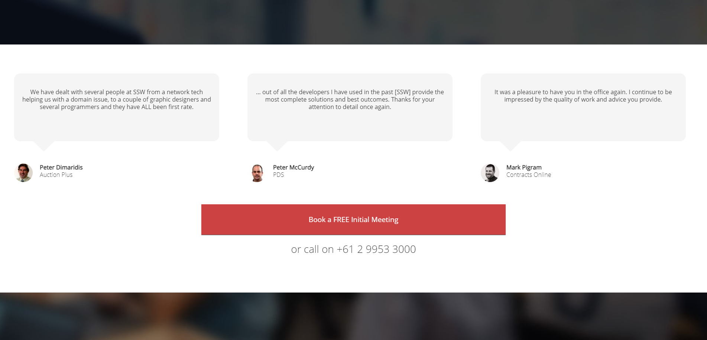

Test Scenario

Hi,

As per our conversation, I'm having problems styling the Testimonials on the Bots page on the SSW website.

Can you please help me out with this?

Problem #1 - Fix the testimonials section as per the screenshots in the designs folder 

Problem #2 - Fix the button and add some sort of cool hover effect.

Feel free to use javascript and add libraries if you believe it will enhance the UX.

If you see anything else on the page that needs to be fixed, either fix it (if it's a quick fix) or let us know about it.

Let me know when you’re done.

If you have any questions, feel free to get in touch.

Cheers, 

DevName  
DevPhoneNumber